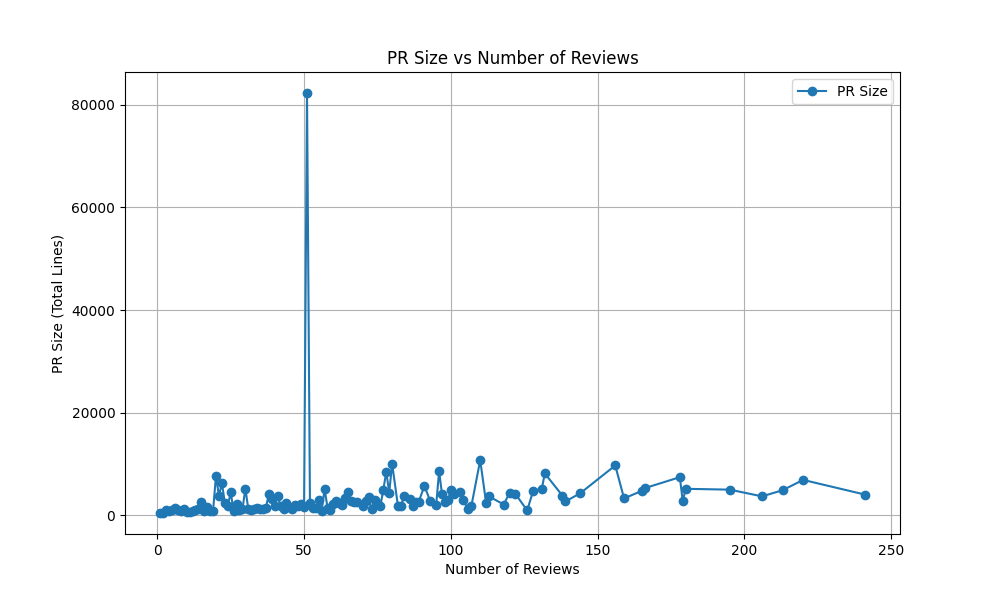

# Caracterizando a atividade de code review no github

## 1. Introdução
A revisão de código é uma prática essencial em projetos de software open-source, particularmente no GitHub, onde a integração de código ocorre por meio de Pull Requests (PRs). Este relatório analisa como diferentes variáveis, como tamanho dos PRs, tempo de análise, interações e descrições, afetam o resultado final das revisões (PR merged ou closed) e o número de revisões realizadas.

## 2. Metodologia

### Criação do Dataset:
O dataset foi construído a partir de PRs submetidos a repositórios populares do GitHub, filtrando PRs com pelo menos uma revisão manual (não realizada por bots). Foram selecionados PRs com status "MERGED" ou "CLOSED", e aqueles cuja revisão durou mais de uma hora. As variáveis coletadas incluem o número de arquivos modificados, linhas adicionadas/removidas, tempo de análise, descrição, interações e estado final do PR.

## 3. Resultados

### A. Feedback Final das Revisões (Status do PR):

### RQ 01: Qual a relação entre o tamanho dos PRs e o feedback final das revisões?

Analisamos o tamanho dos PRs através das métricas de número de arquivos modificados, linhas adicionadas e removidas. Comparando os resultados com o estado final (MERGED ou CLOSED), observamos que PRs com mais linhas modificadas tendem a ser mais frequentemente "CLOSED". A quantidade de arquivos modificados também apresenta uma correlação moderada com PRs fechados sem merge.

**Conclusão:** PRs maiores têm uma tendência maior de serem rejeitados.

### RQ 02: Qual a relação entre o tempo de análise dos PRs e o feedback final das revisões?

PRs que passaram mais tempo em análise (tempo de criação até o merge/close) apresentam uma leve tendência de serem "CLOSED". Contudo, a maioria dos PRs "MERGED" foi analisada em períodos relativamente curtos, sugerindo que PRs mais fáceis de revisar são aceitos mais rapidamente.

**Conclusão:** PRs com tempo de análise mais longo tendem a serem fechadas.

### RQ 03: Qual a relação entre a descrição dos PRs e o feedback final das revisões?

PRs com descrições mais curtas, com menos caracteres, tendem a ser fechadas. Isso pode indicar que uma boa descrição facilita o entendimento do código e aumenta as chances de aprovação.

**Conclusão:** Descrições mais detalhadas aumentam as chances de merge.

### RQ 04: Qual a relação entre as interações nos PRs e o feedback final das revisões?
PRs com mais interações (número de comentários e participantes) apresentam uma maior taxa de aprovação (MERGED), indicando que a discussão ativa e o feedback dos revisores influenciam positivamente no resultado.

**Conclusão:** Mais interações no PR estão associadas a uma maior chance de merge.

### B. Número de Revisões

### RQ 05: Qual a relação entre o tamanho dos PRs e o número de revisões realizadas?

Não foi encontrada uma correlação direta forte entre o tamanho dos PRs e o número de revisões. PRs pequenos e grandes podem ter tanto poucas quanto muitas revisões, dependendo de outros fatores, como complexidade e clareza do código.

**Conclusão:** O tamanho do PR por si só não determina o número de revisões.

### RQ 06: Qual a relação entre o tempo de análise dos PRs e o número de revisões realizadas?

PRs que passaram mais tempo em análise tendem a receber mais revisões, o que sugere que PRs mais complexos ou problemáticos exigem mais ciclos de revisão antes de serem aprovados ou fechados.

**Conclusão:** PRs com mais tempo de análise tendem a ter mais revisões.

### RQ 07: Qual a relação entre a descrição dos PRs e o número de revisões realizadas?

PRs com descrições mais curtas geralmente recebem menos revisões, enquanto PRs com descrições mais detalhadas tendem a passar por mais revisões. Isso sugere que revisores estão mais dispostos a revisar PRs que estão bem documentados.

**Conclusão:** PRs com descrições mais detalhadas recebem mais revisões.

### RQ 08: Qual a relação entre as interações nos PRs e o número de revisões realizadas?

PRs com mais interações (comentários e participantes) tendem a passar por mais revisões, sugerindo que a colaboração entre desenvolvedores e revisores está ligada a um número maior de revisões antes de o PR ser aprovado ou fechado.

**Conclusão:** Mais interações resultam em mais revisões.

## 4. Discussão

Conforme esperado, PRs maiores e mais complexos, com mais linhas adicionadas e arquivos modificados, têm menos chance de serem aceitos. PRs com mais interações e descrições mais detalhadas tendem a ser melhor compreendidos e, portanto, mais frequentemente aprovados. Um tempo de análise maior pode indicar PRs mais complicados, resultando em mais revisões e, em alguns casos, na rejeição do PR.

### Hipóteses
- PRs maiores, com mais linhas adicionadas e arquivos modificados, podem ter menos chances de serem aceitos (merged) devido à complexidade.
- PRs com mais interações (comentários e participantes) tendem a ser mais discutidos, podendo aumentar as chances de aprovação (merged).
- PRs com descrições mais detalhadas podem ser mais compreendidos e, portanto, mais facilmente aprovados.
- Um tempo de análise maior pode estar associado a PRs mais complexos ou problemáticos.

### Valores Obtidos

## 5. Conclusão

A análise mostrou que a clareza da descrição e as interações entre os participantes são fatores críticos para a aceitação de PRs, enquanto o tamanho do PR e o tempo de análise podem ser barreiras para a aprovação. Estratégias como descrições detalhadas e colaboração ativa durante o code review podem melhorar as chances de sucesso no processo de merge.
